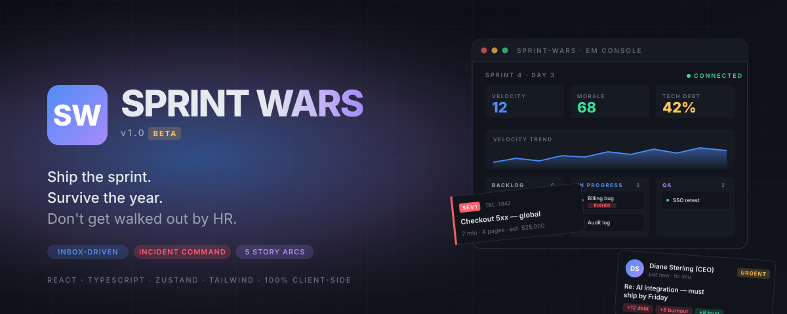

<p align="center">
  
</p>

<p align="center">
  <a href="https://babanomania.github.io/sprint-wars/"><strong>▶ Play it now</strong></a>
  &nbsp;·&nbsp;
  <a href="#run-it-locally">Run locally</a>
  &nbsp;·&nbsp;
  <a href="#deploy">Deploy your own</a>
  &nbsp;·&nbsp;
  <a href="#architecture">Architecture</a>
</p>

<p align="center">
  <a href="https://babanomania.github.io/sprint-wars/">
    
  </a>
</p>

<p align="center">
  <a href="https://vercel.com/new/clone?repository-url=https%3A%2F%2Fgithub.com%2Fbabanomania%2Fsprint-wars">
    
  </a>
  &nbsp;
  <a href="https://app.netlify.com/start/deploy?repository=https://github.com/babanomania/sprint-wars">
    
  </a>
</p>

<p align="center">
  
  <a href="https://babanomania.github.io/sprint-wars/"></a>
  
  
  
  
</p>

---

# Sprint Wars

> A browser-based enterprise software-delivery simulator. Ship the sprint. Survive the year. Don't get walked out by HR.

**v1.0 (beta)** — runs entirely in your browser. No backend, no telemetry. Local saves only.

You play an Engineering Manager / Technical Architect at an enterprise that resembles every place you have ever worked. You have six engineers, a backlog, a CEO who saw a competitor demo last night, and a Slack thread that will not stop. Each in-game week is one sprint. Each sprint is a chance to either ship something useful or watch your stakeholder trust quietly evaporate.

## Features

- **Inbox-driven decisions** — branching emails from execs, security, QA, and one client who keeps using the phrase "circle back." Every choice moves multiple metrics; reply tone (Direct / Corporate / Apologetic / Aggressive) modulates the effect.
- **Incident command** — SEV1-4. Roll back, hot-fix, declare RCA, or ignore. Active incidents bleed stability and pages drag down morale.
- **A team that talks back** — six engineers with skill, morale, burnout, ego, and per-EM loyalty. Push too hard and they update LinkedIn. Each has a hidden flaw that you only learn about after hire.
- **Living architecture** — service dependency graph with health and tech-debt bars. Failures cascade through dependents. Decompose the monolith over many sprints.
- **Long-arc storylines** — Project Helios, the Globex merger, a regulator who is "just curious," a Series-D fundraise, a platform-vs-monolith faction war. Choices in sprint 3 cascade into sprint 9.
- **Sprint planning + standup + retrospective** — commit to story points, get a predicted ship-rate, hear the team's standup updates, then read a generated retro at the end of the sprint with a quote, highlight, and lowlight.
- **Run modifiers + team draft** — pick from five starting conditions (Recently Acquired, Post-Mortem Era, Series C Closed, Pre-IPO Quiet Period, Classic) and draft six archetypes from a pool of twelve.
- **A win condition** — survive your run's goal sprint (annual review, IPO, integration mandate). Or don't.
- **Generated artifacts** — Five-Whys RCAs, retro quotes, news ticker headlines.
- **Streaks, achievements, undo** — three undos per sprint for emails you regret answering.
- **Light + dark themes**, fully responsive (mobile drawer sidebar, snap-scroll Kanban, list-detail Inbox).
- **Synthesized sound effects** — email ding, alert siren, deploy success/fail, win/lose stings, all generated via Web Audio. Mute toggle in the top bar.

## Tech stack

- React 19 + TypeScript
- Vite
- Zustand (with `persist` middleware → localStorage)
- TailwindCSS 3 (CSS-variable-driven theming)
- Framer Motion
- 100% client-side. No backend.

## Run it locally

```bash
npm install
npm run dev
```

Then open http://localhost:5173 and click **Start a new tour**.

```bash
npm run build      # production bundle into ./dist
npm run preview    # preview the prod bundle
```

## Deploy

The app is a fully static SPA — anything that serves `dist/` will host it. Pick whichever is easiest.

### GitHub Pages (where the live build runs)

The live deployment is at **[babanomania.github.io/sprint-wars](https://babanomania.github.io/sprint-wars/)** — every push to `main` triggers [`.github/workflows/deploy.yml`](.github/workflows/deploy.yml), which builds with `VITE_BASE_PATH=/sprint-wars/` so assets resolve under the `/<repo>/` sub-path that Pages serves from.

To wire it up on a fork:

1. In the repo on GitHub, go to **Settings → Pages**.
2. Under **Build and deployment → Source**, choose **GitHub Actions** (not "Deploy from a branch"). Without this the workflow's `actions/configure-pages` step fails — this is the most common reason a fresh Pages setup looks broken.
3. Push to `main`. Watch the **Actions** tab; the deploy URL appears at the top of the run.

### Vercel (also works, zero config)

1. Click the **Deploy with Vercel** button at the top, or [import the repo manually](https://vercel.com/new).
2. Accept the defaults — Vercel auto-detects Vite, runs `npm run build`, and serves `dist/`.
3. Done. Every push re-deploys, every PR gets a preview URL.

`vercel.json` ships in the repo with the framework preset and an SPA rewrite, so there are no settings to fiddle with.

### Netlify

Click the **Deploy to Netlify** button, or run `netlify deploy --prod` after `npm run build`. Netlify auto-detects Vite the same way.

## Architecture

```
src/
├── types/                # all TypeScript interfaces
├── store/gameStore.ts    # Zustand store — single source of truth
├── engine/               # sprint simulation, incident creator, RNG, sound, tone, probability
├── data/                 # email/event/storyline/news/archetype/candidate templates
├── components/
│   ├── shell/            # Sidebar, TopBar, NewsTicker, ThemeToggle, SpeedControls, NotificationToasts
│   ├── ui/               # Icon, MetricBar, Sparkline, Card, EffectChips, ToneSlider
│   └── landing/          # HeroArt
├── modules/              # Dashboard, SprintBoard, Inbox, Incidents, Team, Hire, Architecture, Metrics, ExecChat
├── screens/              # Landing, Setup, Standup, SprintPlanning, Retrospective, WinScreen, LoseScreen
├── hooks/                # useMediaQuery
└── theme/                # useTheme (light/dark toggle)
```

## Game systems

The store ([`src/store/gameStore.ts`](src/store/gameStore.ts)) drives everything. Each "day" tick runs `tickDay` from the engine, which:

1. Advances each developer's progress on their assigned task. Productivity is `morale × burnout × skill × tech-debt-friction × noise`. Hidden complexity may bite mid-task and reveal itself.
2. Rolls bug probability on completion (rushed tasks roll twice as often).
3. Throughputs QA, ages incidents, drifts system health, ticks down budget for cloud burn.
4. Rolls a daily news headline, a possible random event (chance scales with sprint number), an email, and an exec chat prompt.
5. Rolls resignations against `burnout > threshold` where threshold scales with loyalty.
6. At day 5, runs `endOfSprint` which calculates velocity, adjusts trust/patience based on hit-or-miss, and burns salaries.

Game-over conditions: team gone (≤1 active engineer), `patience ≤ 0`, `budget ≤ 0`, `trust ≤ 0`, `stability ≤ 0`. Win condition: reach `goalSprints` (8-14, depending on run modifier).

## License

MIT.
